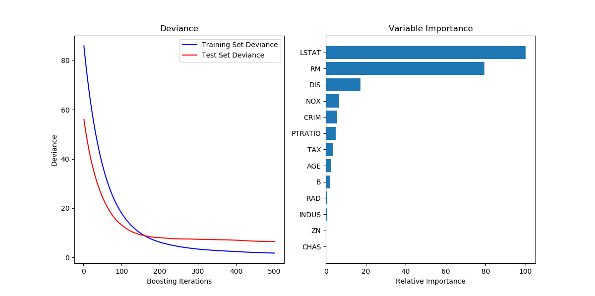
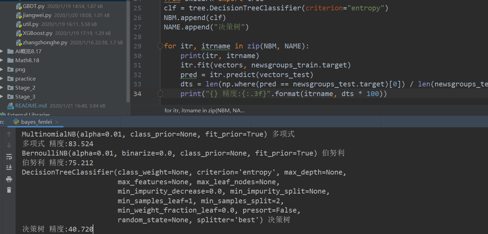
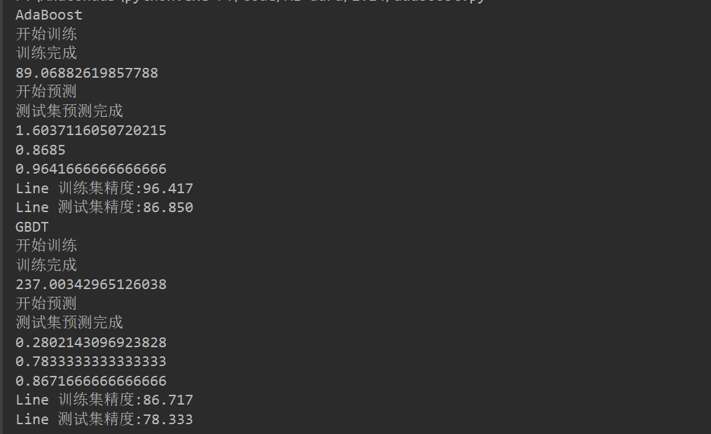

##  课程Q&A
---
2020.1.14
* ~~最大似然估计~~
  - 也就是通过事实（事情发生了），推断出最有可能的条件
* ~~递归特征消除法的实践~~
  - RFE算法的主要思想就是使用一个基模型（这里是S模型VM）来进行多轮训练，每轮训练后，根据每个特征的系数对特征打分，去掉得分最小的特征，然后用剩余的特征构建新的特征集，进行下一轮训练，直到所有的特征都遍历了。
* ~~完成对张忠河对样本集可视化的复现  熟悉其api~~ 
    ```python
  # 注意子图的画法 和散点图能代表相关性
    splt = plt.subplot(4, 4, index)
    splt.scatter(iris.data[:, i], iris.data[:, j], c=iris.target)
    ```
    
* ~~GBDT算法中 feature_importance方法的使用 判断特征的重要程度~~
  - feature_importance用来表示GBDT方法训练的特征重要性的成都



* ~~xgboost的实践~~
* 分类那堂课 9：28之前有讲到针对训练不收敛的情况 用relu来缓解？ 此句话可能有问题

* ~~思考题： 特征数量过多的时候 如何进行特征筛选~~
    - ~~特征筛选~~:(demo见AIE26特征工程文件夹) 与降维不同，其是从原始特征数据集中选择出子集，是一种包含的关系，没有更改原始的特征空间。
        - filter方法： 
            - 卡方检验:https://www.jianshu.com/p/807b2c2bfd9b
            通常英语于某个变量（特征）是不是和因变量有显著的关系
            ```python
            from sklearn.feature_selection import SelectKBest
            from sklearn.feature_selection import chi2#选择K个最好的特征，返回选择特征后的数据
            from sklearn.datasets import load_iris
            iris = load_iris()
            # k Number of top features to select. The “all” option bypasses selection, for use in a parameter search.
            selector = SelectKBest(chi2, k=2).fit(iris.data, iris.target)
            data = selector.transform(iris.data)
            print(data)
            ## 返回的是各个特征按照卡方检验之后的得分 得分高的特征越有效
            print(selector.scores_)
            ``` 
            - 信息增益（决策树ID3）
            - 相关系数
        -  wrapper方法：其主要思想是：将子集的选择看作是一个搜索寻优问题，生成不同的组合，对组合进行评价，再与其他的组合进行比较 比如： 递归特征消除法
        - embedded: 岭回归 lasso回归
    - ~~降维~~ :(https://blog.csdn.net/hellocsz/article/details/80726584)降维的方法主要是通过属性间的关系，如组合不同的属性得新的属性，这样就改变了原来的特征空间（详见jiangwei.py） pca的应用：https://blog.csdn.net/HLBoy_happy/article/details/77146012

* 练习题： 用朴素贝叶斯、决策树、线性回归对鸢尾花数据集进行预测 靠看精度
再将数据放大100倍之后 再训练 看看精度  
目的是看看数据归一化的作用
* ~~用决策树练习本分类问题~~
    - 用决策树来做分类：
    采用entropy的方法 不调整其他的参数 模型的准确率只有40%  
    
  - 衍生出用随机森林来做分类：
    -   随机森林有两个随机性： 
        1.有放回的抽取数据（样本是随机的），做成一个大小为n的训练集（每棵树的训练集是不同的，可能含有重复的训练样本）
        2. 树中每个节点的分裂属性也是随机选择的
        - 为什么使用有放回的数据呢：完全不同的数据集 和完全一样的数据集 训练出来的结果 bagging到一起没有意义 
* ~~用所有学过的分类算法完成手写数字的识别和文本分类这两个问题~~
    - ~~先用adaboost和gbdt实现手写数字的识别问题~~
      
    - ~~SVM进行文本分类~~   
    **用决策树和随机森林做文本分类的准确率特别低  SVM的话 速度特别慢**
    见下面 demo.py和 bayes_fenlei.py
    -   衍生出来用网格法进行调参
        ```python
        
            # ---
            # ## 第五步. 选择最优参数
            
            # ### 问题 7- 网格搜索（Grid Search）
            # *什么是网格搜索法？如何用它来优化模型？*
            
            # ### 问题 7 - 回答:
            # 
            # 网格搜索法是指定参数值的一种穷举搜索方法，通过将估计函数的参数通过交叉验证的方法进行优化来得到最优的学习算法。 
            # 即将各个参数可能的取值进行排列组合，列出所有可能的组合结果生成“网格”。然后将各组合用于SVM训练，使用交叉验证对表现进行评估。在拟合函数尝试了所有的参数组合后，返回一个合适的分类器，自动调整至最佳参数组合。
            
            # ### 问题 8 - 交叉验证
            # - 什么是K折交叉验证法（k-fold cross-validation）？
            # - [GridSearchCV](http://scikit-learn.org/stable/modules/generated/sklearn.model_selection.GridSearchCV.html)是如何结合交叉验证来完成对最佳参数组合的选择的？
            # - [GridSearchCV](http://scikit-learn.org/stable/modules/generated/sklearn.model_selection.GridSearchCV.html)中的`'cv_results_'`属性能告诉我们什么？
            # - 网格搜索时如果不使用交叉验证会有什么问题？交叉验证又是如何解决这个问题的？
            # 
            # **提示：** 在下面 fit_model函数最后加入 `print pd.DataFrame(grid.cv_results_)` 可以帮你查看更多信息。
            
            # ### 问题 8 - 回答：
            # 
            # 1.k折交叉验证法（k-fold cross-validation）即先将全部数据集按照一定比例分成训练集和测试集，然后将训练集分成k个子集，每个子集均做一次测试集，其余的作为训练集。如此交叉验证重复k次，每次选择一个子集作为测试集，并将k次的平均交叉验证识别率作为结果。
            # 优点：所有的样本都被作为了训练集和测试集，每个样本都被验证了一次。
            # 切分方式：默认情况下Kfold是对数据按顺序切分。
            # 
            # 2.网格搜索算法（GridSearchCV）用于系统地遍历多种参数的组合，通过交叉验证来确定最佳效果参数。
            # 
            # 3.GridSearchCV中的'cv_results_'能够输出一个dict，其中包括相关参数的名称以及对应的值。
            # 
            # 4.a.网格搜索时如果不使用交叉验证则可能使得模型泛化能力无法达到最优：因为网格搜索就是尝试各种可能的参数组合值，然后进行交叉验证，找出使交叉验证精确度最高的参数组合。如果不使用交叉验证，那么对于找到的好的参数，不能确保其最精确地预测未知的数据。
            # b.像对数据进行单次分割来进行网格搜索，可能会有什么问题？单次分割不能反映整体预测水平，可能存在该单次分割预测效果好而其他分割情况下预测效果较差的情况，不能保证对应的参数组合就是最优组合。
            # c.交叉验证又是如何避免这个问题的？交叉验证每次选择一个子集作为测试集，并将k次的平均交叉验证识别率作为结果，通过确定最佳效果参数来保证泛化能力。
            
            # ### 编程练习 4：训练最优模型
            # 在这个练习中，你将需要将所学到的内容整合，使用**决策树算法**训练一个模型。为了得出的是一个最优模型，你需要使用网格搜索法训练模型，以找到最佳的 `'max_depth'` 参数。你可以把`'max_depth'` 参数理解为决策树算法在做出预测前，允许其对数据提出问题的数量。决策树是**监督学习算法**中的一种。
            # 
            # 在下方 `fit_model` 函数中，你需要做的是：
            # 1. **定义 `'cross_validator'` 变量**: 使用 `sklearn.model_selection` 中的 [`KFold`](http://scikit-learn.org/stable/modules/generated/sklearn.model_selection.KFold.html) 创建一个交叉验证生成器对象;
            # 2. **定义 `'regressor'` 变量**: 使用  `sklearn.tree` 中的 [`DecisionTreeRegressor`](http://scikit-learn.org/stable/modules/generated/sklearn.tree.DecisionTreeRegressor.html) 创建一个决策树的回归函数;
            # 3. **定义 `'params'` 变量**: 为 `'max_depth'` 参数创造一个字典，它的值是从1至10的数组;
            # 4. **定义 `'scoring_fnc'` 变量**: 使用 `sklearn.metrics` 中的 [`make_scorer`](http://scikit-learn.org/stable/modules/generated/sklearn.metrics.make_scorer.html)  创建一个评分函数；
            #  将 `‘performance_metric’` 作为参数传至这个函数中；
            # 5. **定义 `'grid'` 变量**: 使用 `sklearn.model_selection` 中的 [`GridSearchCV`](http://scikit-learn.org/stable/modules/generated/sklearn.model_selection.GridSearchCV.html) 创建一个网格搜索对象；将变量`'regressor'`, `'params'`, `'scoring_fnc'`和 `'cross_validator'` 作为参数传至这个对象构造函数中；
            #   
            # 如果你对python函数的默认参数定义和传递不熟悉，可以参考这个MIT课程的[视频](http://cn-static.udacity.com/mlnd/videos/MIT600XXT114-V004200_DTH.mp4)。
            
            # In[42]:
            
            # TODO 4
            
            # 提示: 导入 'KFold' 'DecisionTreeRegressor' 'make_scorer' 'GridSearchCV' 
            from sklearn.model_selection import KFold
            from sklearn.metrics import make_scorer
            from sklearn.tree import DecisionTreeRegressor
            from sklearn.model_selection import GridSearchCV
            
            
            def fit_model(X, y):
                """ 基于输入数据 [X,y]，利于网格搜索找到最优的决策树模型"""
            
                cross_validator = KFold(n_splits=10, shuffle=False, random_state=None)
            
                regressor = DecisionTreeRegressor()
            
                params = {'max_depth': [1, 2, 3, 4, 5, 6, 7, 8, 9, 10]}
            
                scoring_fnc = make_scorer(performance_metric)
            
                grid = GridSearchCV(estimator=regressor, param_grid=params, scoring=scoring_fnc, cv=cross_validator)
            
                # 基于输入数据 [X,y]，进行网格搜索
                grid = grid.fit(X, y)
            
                # 返回网格搜索后的最优模型
                return grid.best_estimator_
            
             ```   
        
        
        
 -------------------------------------
 
 
 # 疑问汇总
 - 为什么用朴素贝叶斯做鸢尾花分类效果不好
    -   朴素贝叶斯 基于文本分类的话 效果会好一些 超惨调优一下
 - 做文本分类的时候 决策树和随机森林的精度也都不高 也就50% SVM的训练时间也过长
    -   对文本的特征工程需要下功夫 
    -   SVM数据量